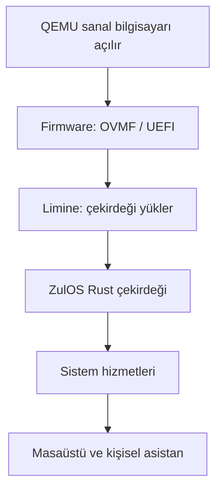

# Bootloader ve Limine nasıl çalışır?

İlk kayıt: 7 Ekim 2026. Son güncelleme: 8 Ekim 2026.

ZulOS'un ilk önyükleyicisi Limine olarak seçildi. Bu belge öğrenme notları ve tasarım önerileri içerir; henüz çalışan bir açılış uygulaması yok. Limine sürümü ve protokol revizyonu henüz seçilmedi.

## Bootloader'ın görevi

Bootloader (önyükleyici), işletim sistemi çekirdeğini belleğe yükleyip çalıştırır. Açılış menüsünde hangi sistemin başlatılacağını seçme görevine boot manager denir. Limine iki görevi de üstlenebilir. [GNU GRUB açıklaması](https://www.gnu.org/software/grub/manual/grub/html_node/Overview.html), [Limine projesi](https://github.com/limine-bootloader/limine/blob/v12.x/README.md)

## Açılış zinciri

İlk ZulOS denemesinde UEFI kullanılması onaylandı. QEMU'daki UEFI ortamını OVMF sağlayacak. OVMF, QEMU için UEFI firmware sunar. [TianoCore OVMF belgeleri](https://www.tianocore.org/tianocore-wiki.github.io/platforms-packages/platform-ports/ovmf.html)

Aşağıdaki şema hedeflediğimiz açılış akışıdır; henüz uygulanmadı.

UEFI firmware'in boot manager'ı açılış seçimine göre bir EFI programını çalıştırabilir. Limine'ın UEFI dosyası bu program olabilir. Önyükleme tamamlanırken UEFI boot services sonlandırılır; runtime services gibi bazı firmware işlevleri kalabilir. [UEFI boot manager](https://uefi.org/specs/UEFI/2.11/03_Boot_Manager.html), [UEFI sistem tablosu](https://uefi.org/specs/UEFI/2.11/04_EFI_System_Table.html)

BIOS açılışının ilk aşamaları farklıdır. Limine'ın UEFI ve BIOS kurulum yolları belgelenmiştir. [Limine kullanım kılavuzu](https://github.com/limine-bootloader/limine/blob/v12.x/USAGE.md)

## Limine'ın hazırlığı ve çekirdeğe devir

Limine, `limine.conf` içindeki seçime göre çekirdek dosyasını ve varsa başlangıç modüllerini yükler; başlangıç parametrelerini aktarabilir. [Yapılandırma belgesi](https://github.com/limine-bootloader/limine/blob/v12.x/CONFIG.md)

Limine protokolünde çekirdeğin içine istek yapıları yerleştirilir. Önyükleyici desteklediği istekleri yanıtlar; çekirdek başlangıçta bu yanıtları okur. Bellek haritası ve framebuffer bilgisi bu yolla istenebilir. Framebuffer, ekranın piksellerini yazabileceğimiz bellek alanıdır. Yanıt bulunmamasını da ele almamız gerekir.

x86_64 girişinde 64 bit çalışma ortamı, başlangıç sayfa tabloları ve stack hazırlanmıştır. Limine çekirdeğin giriş adresine geçer. Kesme altyapısını kurmak çekirdeğe kalır. [Limine protokolü](https://github.com/limine-bootloader/limine-protocol/blob/trunk/PROTOCOL.md)

Bu devirden sonra çekirdeğimiz zamanla bellek yönetimi, görevler, kesmeler ve sürücüler gibi sorumlulukları üstlenecek. Sistem hizmetleri ve kişisel asistan bunların üzerine kurulacak. Bu, ZulOS için geliştirme yönümüz; bugün mevcut özellikler değil.

Limine günlük uygulama çalıştırmayı ve kişisel asistan davranışlarını yönetmez. İhtiyacı biten önyükleme belleğini geri kullanmayı çekirdekte doğru zamanda tasarlayacağız.

## Diğer sistemlerdeki örnekler

- Windows'un UEFI açılışında firmware, Windows Boot Manager'ı başlatır; ardından Windows loader ve NT çekirdeği çalışır. [Microsoft açıklaması](https://learn.microsoft.com/en-us/troubleshoot/windows-client/performance/windows-boot-issues-troubleshooting)
- GRUB, Linux dahil desteklediği çekirdekleri yükleyip kontrolü devredebilir. [GNU GRUB](https://www.gnu.org/software/grub/)

Araçlar değişir; çekirdeğin yüklenmesi ve ona kontrol devri ortak bir görevdir.

## ZulOS'a katabileceğimiz fikirler

Aşağıdakiler öneridir. Kullanıcının "buraya bir şey katabilir miyiz?" sorusunu araştırmak için kaydedildi.

### Açılış yapılandırması

Normal açılış, kurtarma veya AI kapalı başlangıç gibi seçenekler düşünülebilir. Limine menü seçenekleri ve çekirdeğe parametre aktarma mekanizması sunar. Bu parametrelerin anlamını ve davranışını ZulOS uygulamalı. Asistanın kapalı başlaması gibi bir özelliği yalnızca menüye yazmak gerçekleştirmez.

Logo, menü görünümü ve bekleme süresi de özelleştirilebilir. Bunlar mevcut Limine yeteneklerinden yararlanmaktır. [Limine yapılandırması](https://github.com/limine-bootloader/limine/blob/v12.x/CONFIG.md)

### Başarısız güncellemeden geri dönüş

Önerilen tasarım: Son çalışan sürümü saklamak, yeni sürümü denemek ve sistem yeterince hazır olduğunda kalıcı bir başarı kaydı üretmek. Tamamlanmayan denemeler sonraki açılışta kurtarma veya önceki sürüme dönüş için kullanılabilir.

Otomatik geri dönüş; kalıcı kayıt, deneme sayacı, açılışta sürüm seçimi ve işletim sisteminin işbirliğini gerektirir. Limine seçimi tek başına bu özelliği sağlamaz. Başarısız sistemin yeniden başlatılmasını tetikleyecek yöntem de ayrıca tasarlanmalı. Sistem sürümüne dönmek, kullanıcı dosyalarına yapılan her değişikliği geri almak anlamına gelmez.

### Güvenilir başlangıç

Çekirdek ve başlangıç dosyalarının bütünlüğünü kontrol eden bir açılış zinciri araştırılabilir. Limine'ın belgelenmiş Secure Boot ve ölçümlü açılış seçenekleri var; bunların çalışması doğru yapılandırmaya ve ilgili platform desteğine bağlı. ZulOS'ta henüz kurulmadı. [Limine kullanım kılavuzu](https://github.com/limine-bootloader/limine/blob/v12.x/USAGE.md)

### Kullanıcının işine daha çabuk hazır olmak

Önce ihtiyaç duyulan hizmetleri başlatıp diğerlerini erteleme veya önceki çalışma alanını geri getirme gibi deneyler düşünülebilir. Bu davranışların önemli kısmı çekirdek başladıktan sonraki sistem hizmetlerinde gerçekleşir.

Kişisel asistan için önerimiz de bu hizmetler aşamasında çalışmak. Açılışta aktarılacak az sayıdaki ayarla, kullanıcı verilerini ve AI davranışlarını yönetecek hizmetleri ayrı tasarlayabiliriz.

### Limine projesine katkı

Gerçek bir ihtiyaç veya hata bulursak yeniden üretilebilir bir örnek, düzeltme ya da belge iyileştirmesi hazırlayabiliriz. Önce mevcut yapılandırma ve protokolün ihtiyacımızı karşılayıp karşılamadığını inceleyeceğiz. Şu aşamada Limine kaynak kodunda değişiklik veya ayrı bir fork kararı yok.

## İlk öğrenme deneyi önerisi

Limine bir çekirdek dosyasını yüklesin; Rust çekirdeğimiz framebuffer yanıtını kontrol etsin ve ekrana ilk çıktısını versin. Bu deneyde önyükleyicinin hangi veriyi hazırladığını ve çekirdeğin o veriyle ne yaptığını takip edeceğiz.

Deney henüz uygulanmadı. Çekirdek kodu, araç kurulumu ve QEMU'da çalıştırma sonraki geliştirme adımları.
